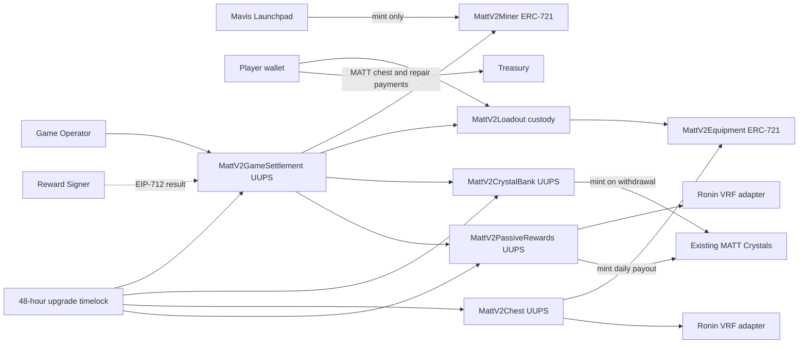

# MATT Mine NFT V2 contract architecture

Status: implemented local architecture for the approved `NFT_V2_SPEC.md` rules; not deployed.

## Contract boundary

## Permanently non-upgradeable contracts

### `MattV2Miner`

- ERC-721 ownership, 1,000 hard supply cap, ERC-2981 5% royalty, and ERC-4906 metadata events.
- Stores XP, derived level, Level-100 rate, activity timestamps, active-run lock, and timestamped ownership checkpoints.
- Exposes deterministic trait calculations from the approved endpoints and XP curve.
- Grants only narrow mint, progression, lock, passive-state, and metadata roles.
- Blocks transfer while a run is active.

### `MattV2Equipment`

- One ERC-721 collection for Armor, Pickaxe, Blaster, Dynamite, Helmet, and Backpack.
- Stores slot, rarity, visual definition, damaged state, and equipped Miner ID.
- Derives every gameplay bonus from the immutable slot-and-rarity table.
- Equipped tokens cannot transfer independently.
- Only the fixed Loadout custody contract can assign, damage, repair, release, or burn equipped items.

### `MattV2Loadout`

- Holds equipped Equipment NFTs in custody so beneficial control follows Miner ownership.
- Exactly one item per slot.
- Miner owner may equip, unequip, and repair only while no run is active.
- Death damages Armor and burns Backpack; extraction preserves both.
- Repair transfers the configured MATT amount directly to Treasury.

### `MattV2UpgradeTimelock`

- Root-controlled, non-upgradeable scheduler for UUPS upgrades.
- Every upgrade requires an immutable 48-hour delay.
- Upgrade identifiers bind chain, timelock, proxy, implementation address, implementation bytecode hash, calldata, and salt.

## Governed UUPS modules

### `MattV2GameSettlement`

- Stores immutable map versions and current map availability.
- Begins player-authorized runs through the Game Operator and snapshots map, Miner, and loadout values.
- Requires both the Game Operator transaction and independent Reward Signer EIP-712 signature to settle.
- Calculates XP, carry capacity, conversion, death retention, and the 100,000-Crystal run ceiling on-chain.
- Applies progression, activity, Armor/Backpack consequences, Crystal-bank credit, and unlocking atomically.
- Allows owner force-abandon after the snapshotted timeout with death consequences and no session rewards.

### `MattV2CrystalBank`

- Holds wallet-owned, on-chain gameplay balances.
- Accepts credit only from Game Settlement.
- Mints existing MATT Crystals only during a successful player withdrawal.
- Enforces configurable minimum, wallet daily limit, and global daily limit beneath immutable ceilings.

### `MattV2Chest`

- Offers six slot-specific MATT chests with immutable 68/18/8/5/1 rarity odds.
- Pins price and definition-pool version when purchased.
- Escrows payment until the original VRF request fulfills.
- Sends successful payment to Treasury or permits a permanent cancellation and full refund after 24 hours.

### `MattV2PassiveRewards`

- Requests exactly one permanent Level-100 rate through its dedicated VRF adapter.
- Implements the approved weighted 5-50 whole-number distribution without rerolls.
- Records activity intervals and calculates exact eligible seconds, including first-day proration and inactive gaps.
- Uses Miner ownership checkpoints to pay the owner at each 00:00 UTC boundary.
- Processes at most 100 Miners per transaction; catch-up is permissionless after one hour and idempotent.

## Deployment and activation order

1. Deploy the non-upgradeable 48-hour Upgrade Timelock.
2. Deploy non-upgradeable Miner and Equipment ownership contracts.
3. Deploy non-upgradeable Loadout custody.
4. Deploy implementations and ERC-1967 proxies for Bank, Passive Rewards, Settlement, and Chest.
5. Deploy one dedicated Ronin VRF adapter for Chest and another for Passive Rewards.
6. Wire narrow inter-contract roles while every gameplay contract remains paused.
7. Authorize only Bank and Passive Rewards as MATT Crystal minters.
8. Configure metadata, Treasury, maps, prices, withdrawal limits, and VRF subscriptions.
9. Replace the shared bootstrap holder with distinct Reward Signer and Game Operator wallets.
10. Verify code, roles, caps, proxy implementations, timelock ownership, and read-only invariants before unpausing.

Mainnet deployment is prohibited until local tests, Saigon rehearsal, source verification, and an independent security review are complete.
